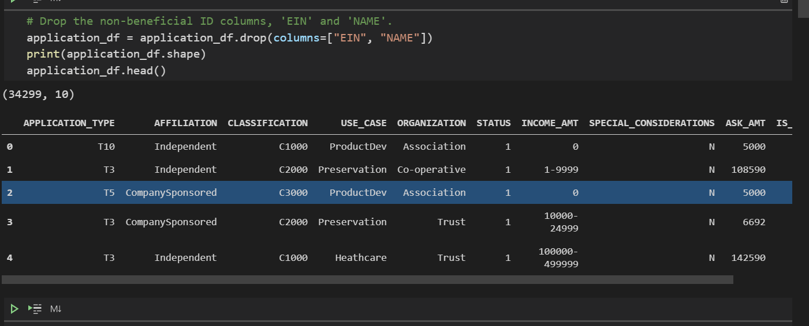
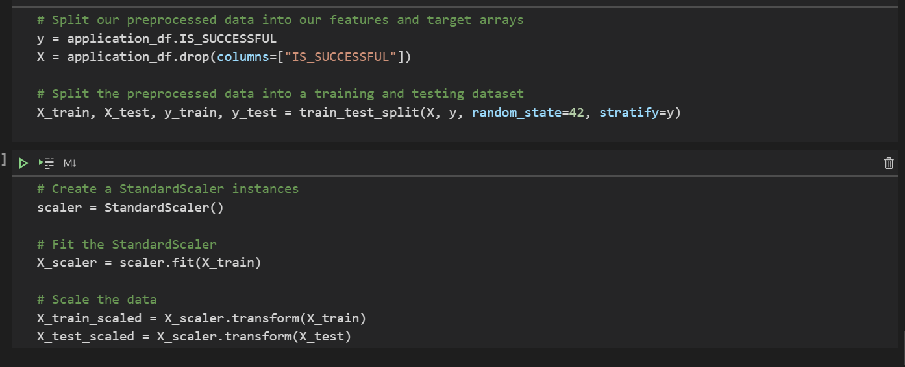
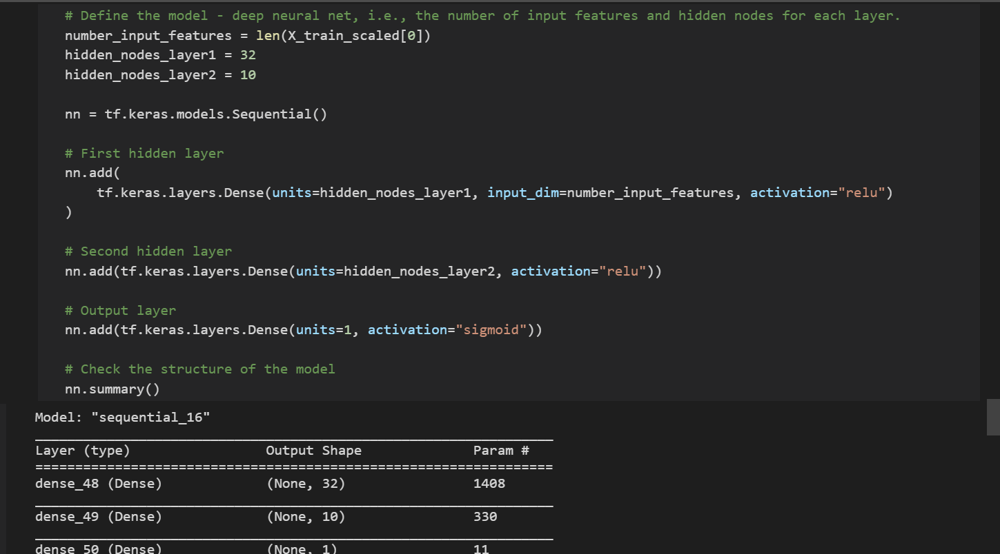
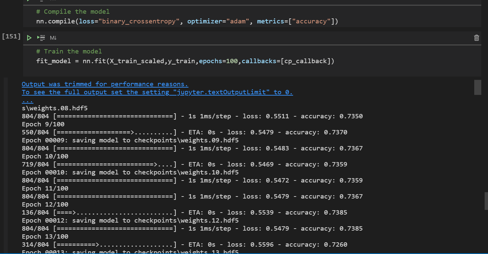

# Neural_Network_Charity_Analysis

# Overview of the analysis
We are using the features in the provided dataset to create a binary classifier that is capable of predicting whether applicants will be successful if funded by the investor, Alphabet Soup.

From Alphabet Soup’s business team, we received a CSV containing more than 34,000 organizations that have received funding from Alphabet Soup over the years. Within this dataset are a number of columns that capture metadata about each organization, such as the following:

+ EIN and NAME—Identification columns
+ APPLICATION_TYPE—Alphabet Soup application type
+ AFFILIATION—Affiliated sector of industry
+ CLASSIFICATION—Government organization classification
+ USE_CASE—Use case for funding
+ ORGANIZATION—Organization type
+ STATUS—Active status
+ INCOME_AMT—Income classification
+ SPECIAL_CONSIDERATIONS—Special consideration for application
+ ASK_AMT—Funding amount requested
+ IS_SUCCESSFUL—Was the money used effectively

# Results
1. Data Preprocessing
The dataset was clean up and uneccessary columns dropped. Such as "EIN","ORGANIZATION" and "NAME". The "ORGANIZATION" column was dropped in the stage of optimzing the deep learning model. 

These variables were becasue they were not considered as neither features or target from the input data.

We considered IS_SUCCESSFUL as the target variable because its captured the successful rate of investment made in cryptocurrency by AlphabetSoup. 

We assign it to y and remaining variable alocated to X as features variables.

2. Compiling, Training, and Evaluating the Model
Neurons used prior optomization were 42 and 20 hideen layers and features selcted were as per the dataset fatures. The selection was based on the larger dataset. Despite the number of neurons, the performance was still below the 75% mark.

The steps taken to optimize the model included removing the noisy variables ("EIN", "ORGANIZATION", and "NAME").  We added additional neurons and hidden layers.

We also use the relu function and output was changed multpiple times for optimization as well.

# Summary
We found that our model do perform poolrly whe trying to optimize the performance. By remkving uneccessary noisy variables and increasing additional neurons to the hidden layers does not make a huge difference. Chck the evaluation after saving the model below.

Our initial model had an accuracy of .725 compared to the optimized which dropped to .71. 

The recommendation is to use the much mre light machine learning models and compare with the advanced deep learning. After that, we shall know how to navigate and improve and choose whihc model to use based on teb presented dataset.